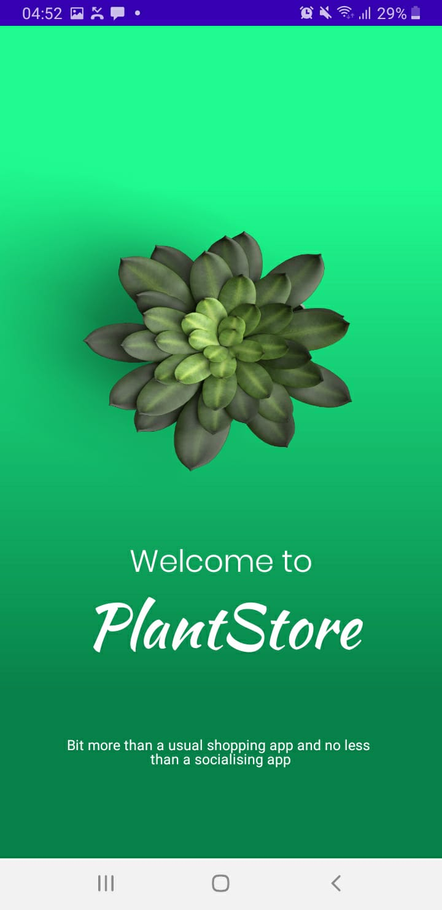
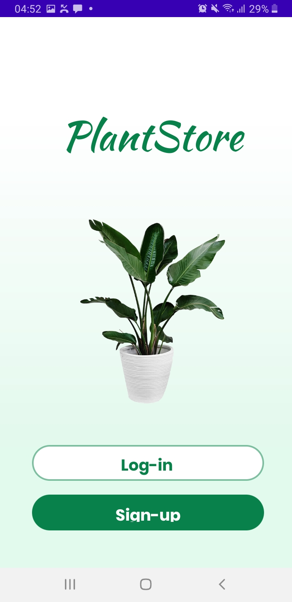
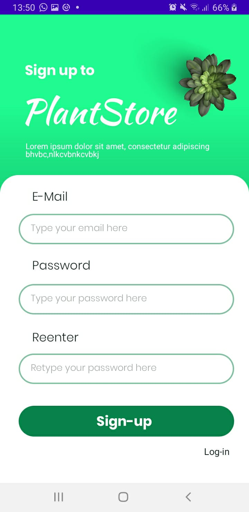
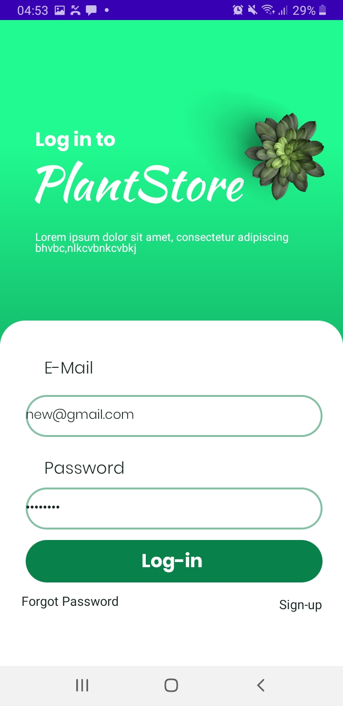
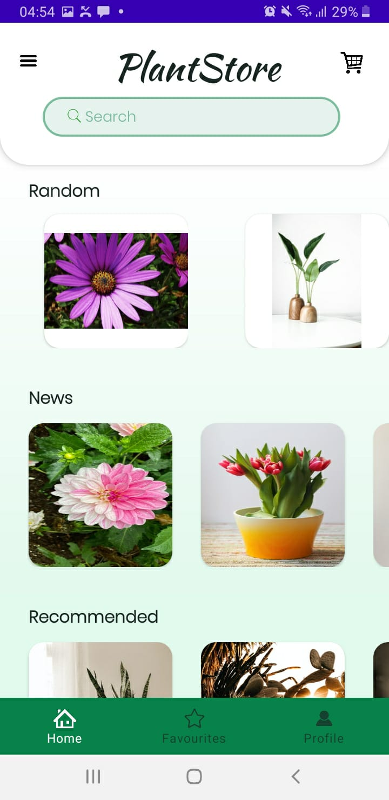
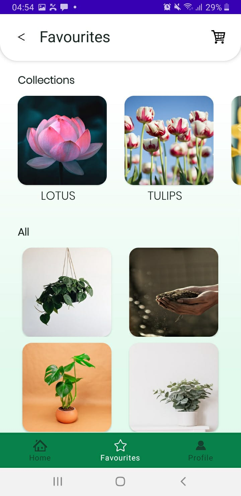
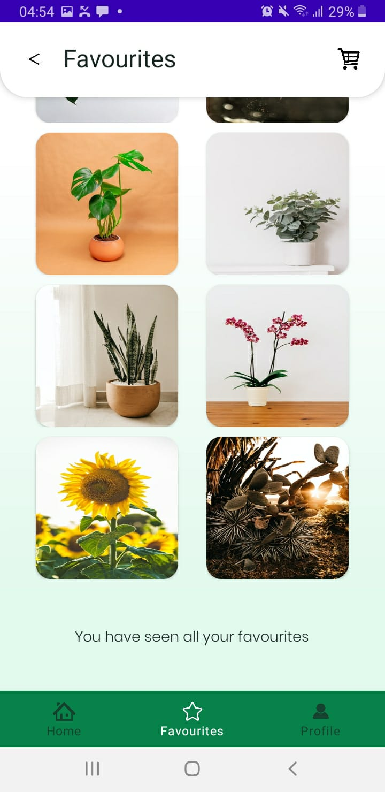
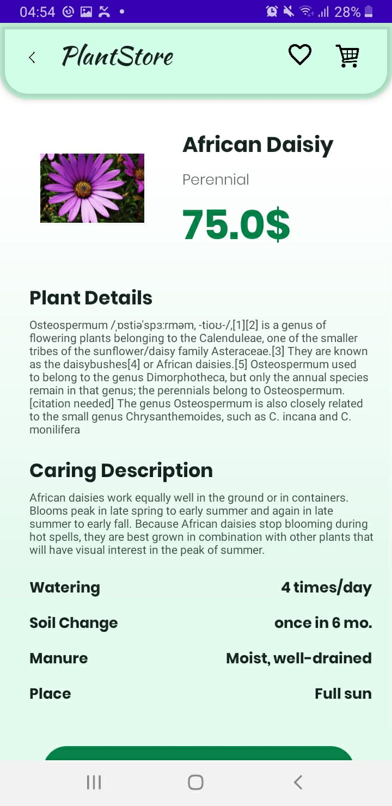

# PlantStore App

Développement d'une application mobile pour répondre principalement à notre concept moteur «Des plantes pour tous». En effet, notre proposition est une solution à la fois d'achat en ligne et de livraison, et de partage pour assurer la meilleure protection aux plantes. Ainsi, non seulement les clients des grandes jardineries se procureront des plantes et non seulement les avertis s'en occuperont, mais tout le monde.

# Quelques Interfaces HM
Précision: le design de l'application est basé sur la template https://www.figma.com/file/9vU59Cnl4kENAbIq8mjZVo/Plantsdeck-Project-(Community)?node-id=7%3A51
***

 

